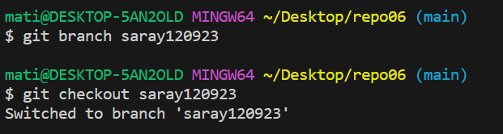
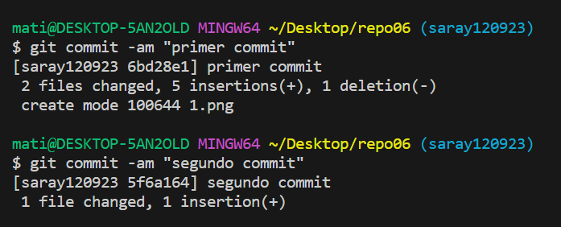

# Ejercicio 5
Clonamos el repositorio creado en github mediane git clone y una vez abierto en VSC creamos una nueva rama y entramos, como vemmos en la siguiente imagen.
>

En la siguiente imagen observamos que hemos hecho algunos commits.
>

Hacemos un último commit.
