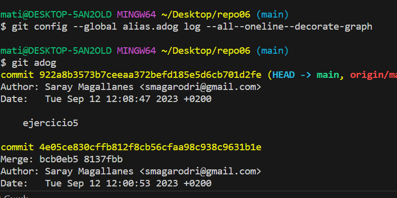

# Ejercicio 5
Clonamos el repositorio creado en github mediane git clone y una vez abierto en VSC creamos una nueva rama y entramos, como vemmos en la siguiente imagen.
>

En la siguiente imagen observamos que hemos hecho algunos commits.
>

Hacemos un último commit.
>

Subimos la rama a github antes de hacer merge.
>

Entramos de nuevo en la rama main y posteriormente hacemos merge.
>

Visualizamos desde git log "alog".
>

Visualizamos desde plugin VSC.
>

# Ejercicio 6

Eecutamos el siguiente comando para poner un "alias". La próxima vez que utilicemos "git adog" ya funcionará, como podemos ver en la imagen.
>

